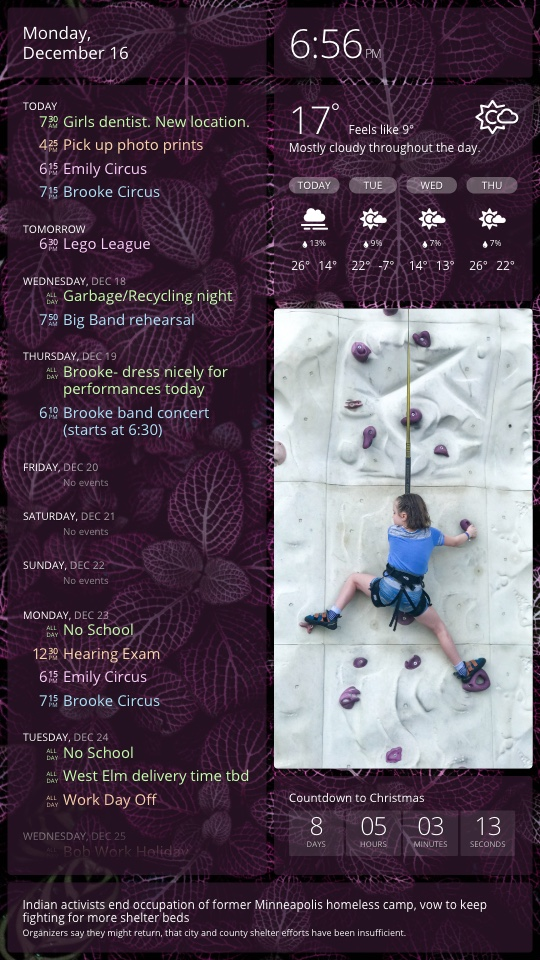

# dakboard

This project takes a DIY [DAKboard](https://dakboard.com) and customizes it with two features:

-   A [Python script](raspberrypi/dakboard-detect-motion.py) and PIR motion detector to turn the display on and off for power savings.
-   [Handwritten CSS](two-column-portrait.css) for a two-column portrait layout that looks like this:

    

    _[Background photo](https://unsplash.com/photos/gE1phX0Lbos) by [Hybrid](https://unsplash.com/@artbyhybrid?utm_medium=referral&utm_campaign=photographer-credit&utm_content=creditBadge) on [Unsplash](https://unsplash.com)._

## Hardware

### Final Design

| Part                                                                                                                                                         |  Cost | Notes                                                                                                                                                                                                                                                                                  |
| ------------------------------------------------------------------------------------------------------------------------------------------------------------ | ----: | -------------------------------------------------------------------------------------------------------------------------------------------------------------------------------------------------------------------------------------------------------------------------------------- |
| [Dell UltraSharp 25" QHD Monitor (U2518D)](https://www.dell.com/en-us/work/shop/dell-ultrasharp-25-monitor-u2518d/apd/210-amll/monitors-monitor-accessories) | \$125 | I bought this used from a coworker. I found it attractive because of its size, its IPS panel with descent viewing angles, and its QHD resolution.                                                                                                                                      |
| [Raspberry Pi 4 Model B with 1GB RAM](https://www.raspberrypi.org/products/raspberry-pi-4-model-b/) and accessories                                          |  \$45 | After I bought the QHD (2560×1440) monitor, I wanted to drive it at its native resolution and the Pi 4 is the only model capable of going above Full HD (1920×1080). I bought one from Micro Center, along with a power supply and an inexpensive 16GB microSD card.                   |
| [Adafruit PIR Sensor](https://www.adafruit.com/product/189)                                                                                                  |  \$11 | I purchased this part from Amazon because Adafruit was out of stock! A nicely detailed [guide](https://cdn-learn.adafruit.com/downloads/pdf/pir-passive-infrared-proximity-motion-sensor.pdf) is available (provided here because it's found a few clicks away from the product page). |
| [Smraza Case for Rasberry Pi 4 B](https://www.amazon.com/gp/product/B07VDCT57F/ref=ppx_yo_dt_b_asin_title_o04_s01?ie=UTF8&psc=1)                             |  \$10 | The Pi 4 runs hot, and so I bought this case because it comes with a cooling fan and heat sinks.                                                                                                                                                                                       |
| 2GB USB Thumb Drive                                                                                                                                          |   \$0 | I used this old thumb drive I had lying around for swap space instead of using the SD card. Had I known that I would have to solve this problem, I would've payed the extra $10–$20 for a 2GB or 4GB version of the Pi 4.                                                              |
|                                                                                                                                                              | \$191 | Total cost.                                                                                                                                                                                                                                                                            |

### Prototype

Development was conducted on hardware that I already owned before I invested in the equipment above. This hardware would've been sufficient at a viewing distance farther away from the screen than I was planning. Close up the 32" Full HD (1080×1920) display becomes a little too pixelated for my taste.

| Part                                                                                                                                                 | Cost | Notes                                                                                                                                                                                                                                                    |
| ---------------------------------------------------------------------------------------------------------------------------------------------------- | ---: | -------------------------------------------------------------------------------------------------------------------------------------------------------------------------------------------------------------------------------------------------------- |
| [Samsung 32" Class M5300 Full HD TV](https://www.samsung.com/us/televisions-home-theater/tvs/full-hd-tvs/32--class-m5300-full-hd-tv-un32m5300afxza/) |  \$0 | After moving homes we no longer had an obvious spot for this TV, so it was an available display with which to experiment.                                                                                                                                |
| [Raspberry Pi 3 Model B](https://www.raspberrypi.org/products/raspberry-pi-3-model-b/)                                                               |  \$0 | I received this as a prize at a work function years ago. It was just sitting in my home office collecting dust until my wife inspired me to try making a DAKboard with it.                                                                               |
| [Smraza Basic Starter Kit with Breadboard](https://www.amazon.com/gp/product/B01HRR7EBG/ref=ppx_yo_dt_b_asin_title_o09_s00?ie=UTF8&psc=1)            | \$13 | I needed a breadboard, power supply, LEDs, resistors, push buttons, and patch wires to familiarize myself with the PIR sensor and programming the Pi's GPIO pins. This kit has all that and more. I feel like owning this kit gives me some hacker cred! |
|                                                                                                                                                      | \$13 | Total cost.                                                                                                                                                                                                                                              |

## Software

### Raspberry Pi Configuration

1. Follow the steps found at [DIY Wall Display](https://blog.dakboard.com/diy-wall-display/) until the "Turn the monitor on and off automatically (optional)" section. Rather than control the display on a schedule, as that section explains, this project controls it via a motion sensor.

2. Depending on the display being used, install the HDMI-CEC client. Screenly has a great [article on three ways to turn on/off a monitor](https://www.screenly.io/blog/2017/07/02/how-to-automatically-turn-off-and-on-your-monitor-from-your-raspberry-pi/) programmatically from a Raspberry Pi. That article is two and a half years old at the time of this writing and the installation command is slightly different now:

    ```bash
    sudo apt-get install cec-utils
    ```

    With that information in hand, some trial and error lead me to the most effective command for each of the displays that I tested. Your mileage may vary and you may or may not need the CEC client.

    | Display           | Command      | Notes                                                                                                                                                                                                                                                                                                   |
    | ----------------- | ------------ | ------------------------------------------------------------------------------------------------------------------------------------------------------------------------------------------------------------------------------------------------------------------------------------------------------- |
    | Dell U2518D       | `vcgencmd`   | The Dell doesn't respond to CEC commands, which I suppose makes sense because the monitor wasn't designed to be connected to a chain of home theater components. It does go to sleep about 15–20 seconds after the HDMI signal turns off, and wakes back up in about 5 seconds when the signal returns. |
    | Samsung UN32M5300 | `cec-client` | The Samsung stays on for a long while after the HDMI signal is off, presenting a "No Source" message, which is undesirable. But it responds nicely to CEC commands telling the TV to enter standby mode or active mode.                                                                                 |

3. Add and configure the USB thumb drive to serve as a swap space.

    I never needed to configure additional swap space on the Pi 3 that I used for prototyping. But running the Pi 4 for a matter of hours or days, the system would eventually encounter an out-of-memory scenario that manifested as a Chromium "Aww, Snap!" error. Perhaps I never ran the Pi 3 for long enough to observe the error. Or maybe running the Pi 4 at 1440p (instead of 1080p) is demanding enough to warrant additional memory. In retrospect I wish I would've opted for the 2GB or 4Gb version of the Pi 4 and avoided this issue altogether.

    Raspbian ships with a preconfigured 100MB swap file at `/var/swap`, which by default resides on the SD card. Simply increasing the size of that swap file made the error go away. However, there are a lot of warnings online advising against using the SD card for swapping because it isn't made for a lot of random I/O and can eventually become corrupted, taking the OS with it.

    So in an effort to heed those warnings, I first tried using [ZRAM](https://github.com/novaspirit/rpi_zram). This approach extended the amount of time between "Aww, Snap!" occurrences, but didn't eliminate them. I settled on using a USB thumb drive for swapping, knowing full well that it isn't a terribly fast or robust solution. I'm OK with that, I just need Chromium and the system to not crash!

    1. Format the USB drive: <https://www.pidramble.com/wiki/benchmarks/external-usb-drives#format-a-usb-connected-drive-on-the-raspberry-pi-in-raspbian>.
    2. Mount the USB drive at an exact location upon boot: <https://www.raspberrypi.org/documentation/configuration/external-storage.md>. I specified `/mnt/usb` as the mount point.
    3. Configure the system to swap memory to the USB drive instead of the SD card: <https://nebl.io/neblio-university/enabling-increasing-raspberry-pi-swap/>. In my case, I changed to the following.

        ```bash
        CONF_SWAPFILE=/mnt/usb/swap
        CONF_SWAPFACTOR=1
        ```

        My system devotes 128MB of its 1GB of RAM to the GPU, leaving 872MB of general purpose memory. Note that `dphys-swapfile` limits the swap file to 50% of the disk size, and half of a 2GB thumb drive (after subtracting partitioning and formatting overhead) equates to about 862MB. So the swap file is about 10MB shy of the `CONF_SWAPFACTOR=1` setting. Observations reveal that this is more than sufficient.

### The Python Script

TODO: Describe the Python script.

1. Start the Python script on boot by adding this line to /etc/rc.local:

    ```bash
    sudo python3 -m interdaktive \
        --control-button-pin=BOARD36 \
        --display-type=mock \
        --motion-sensor-pin=BOARD7 \
        --motion-led-pin=BOARD22 \
        --running-led-pin=BOARD18 \
        --sleep-delay-seconds=5 \
        --waking-time-begin=06:00 \
        --waking-time-end=22:00 &
```
