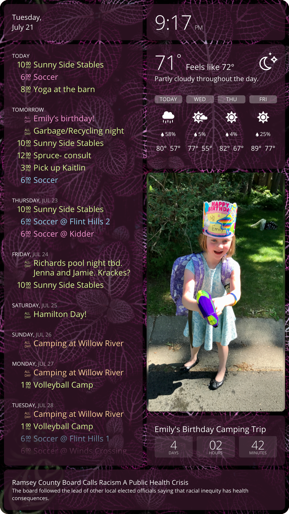

# dakboard

This project starts with a [DIY DAKboard](https://blog.dakboard.com/diy-wall-display/) and customizes it with two features:

- A [Python package](interdaktive/) that interfaces with a PIR motion sensor to programmatically turn the display on and off.
- [Handwritten CSS](css/) for a two-column portrait layout that looks like this:

    

    _[Background photo](https://unsplash.com/photos/gE1phX0Lbos) by [Hybrid](https://unsplash.com/@artbyhybrid?utm_medium=referral&utm_campaign=photographer-credit&utm_content=creditBadge) on [Unsplash](https://unsplash.com)._

## Presentation

I created an [online presentation](https://robertbullen.github.io/dakboard/) about this project for a talk at work:

- It's a [Reveal.js](https://revealjs.com/#/) project and its source code can be found in this repo's [docs/](docs/) subdirectory. My slides, in particular, are found in [docs/slides/](docs/slides/).
- A viewable instance is hosted by [GitHub Pages](https://pages.github.com/) at <https://robertbullen.github.io/dakboard/>.

## Credits

This project was sponsored in part by my employer, [Constellation](https://constellationmutual.com/). As part of its employee growth and development strategy, Constellation allocates IT staff 12 Personal Hack Days per year to pursue self-guided technology-related interests. I used four of my Personal Hack Days (plus more of my own time) working on this project.

## Software

### Raspberry Pi Configuration

1. Follow the steps found at [DIY Wall Display](https://blog.dakboard.com/diy-wall-display/) until the "Turn the monitor on and off automatically (optional)" section. Rather than control the display on a schedule, as that section explains, this project controls it via a motion sensor.

2. Depending on the display being used, install the HDMI-CEC client. Screenly has a great [article on three ways to turn on/off a monitor](https://www.screenly.io/blog/2017/07/02/how-to-automatically-turn-off-and-on-your-monitor-from-your-raspberry-pi/) programmatically from a Raspberry Pi. That article is two and a half years old at the time of this writing and the installation command is slightly different now:

    ```bash
    sudo apt-get install cec-utils
    ```

    Another great tutorial is [Using HDMI-CEC on a Raspberry Pi](https://pimylifeup.com/raspberrypi-hdmi-cec/).

    With that information in hand, some trial and error lead me to the most effective command for each of the displays that I tested, which I documented in my [presentation](https://robertbullen.github.io/dakboard/#/software-controlling-displays). Your mileage may vary and you may or may not need the CEC client.

3. [_Optional_] Add and configure a USB 3.0-attached SSD drive as the boot drive for a larger swapfile with more reliable I/O.

    > Background:
    >
    > I never needed to configure additional swap space on the Pi 3 that I used for prototyping. But when using the Pi 4 for a matter of hours or days, the system would eventually encounter an out-of-memory scenario that manifested as a Chromium "Aww, Snap!" error. Perhaps I never ran the Pi 3 for long enough to observe the error. Or maybe running the Pi 4 at 1440p (instead of 1080p) is demanding enough to warrant additional memory. In retrospect I wish I would've opted for the 2GB or 4Gb version of the Pi 4 and avoided this issue altogether.
    >
    > Raspbian ships with a preconfigured 100MB swap file at `/var/swap`, which by default resides on the SD card. Simply increasing the size of that swap file prevented the out-of-memory errors. However, there are many warnings online advising against using the SD card for swapping because it isn't made for a lot of random I/O and can eventually become corrupted, taking the OS with it. I can confirm that with my own experiences using cheap SD cards.
    >
    > In an effort to heed those warnings, I first tried using [ZRAM](https://github.com/novaspirit/rpi_zram). This approach lengthened the amount of time between "Aww, Snap!" occurrences, but didn't eliminate them.
    >
    > I eventually settled on using a spare SSD to use as the boot drive, with benefits of faster and more reliable I/O.

    1. Configure the system to boot from an external SSD: <https://www.tomshardware.com/how-to/boot-raspberry-pi-4-usb>.
    2. Increase the swapfile size according to the instructions at <https://nebl.io/neblio-university/enabling-increasing-raspberry-pi-swap/>. In my case, I changed to the following:

        ```bash
        #CONF_SWAPSIZE=100
        CONF_SWAPFACTOR=2
        ```

4. Clone this repository to your Raspberry Pi.

    ```bash
    # Substitute your forked repository URL if necessary.
    git clone https://github.com/robertbullen/dakboard.git
    ```

5. Start the Python script on boot by adding this line to /etc/rc.local:

    ```bash
    # This assumes the user is the default (pi) and that the repository has
    # been cloned to that user's home directory.
    pushd /home/pi/dakboard || exit $?
    sudo ./update.sh || exit $?
    sudo ./start.sh &
    popd
    ```
